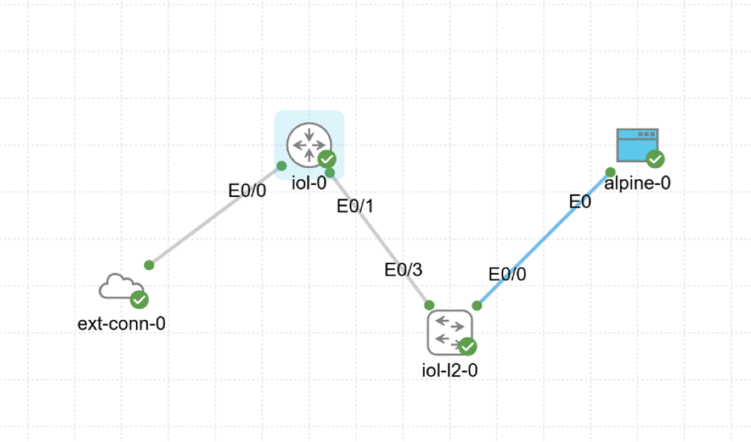
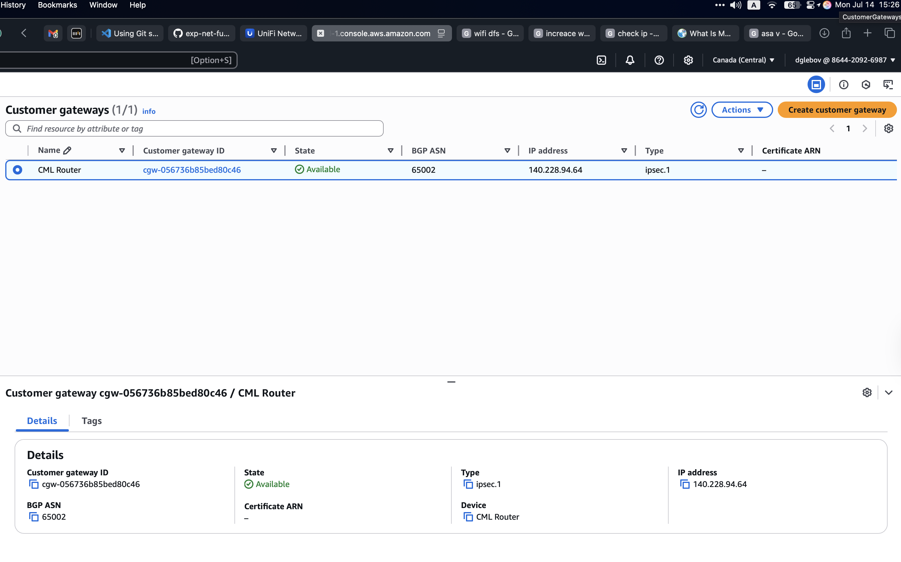
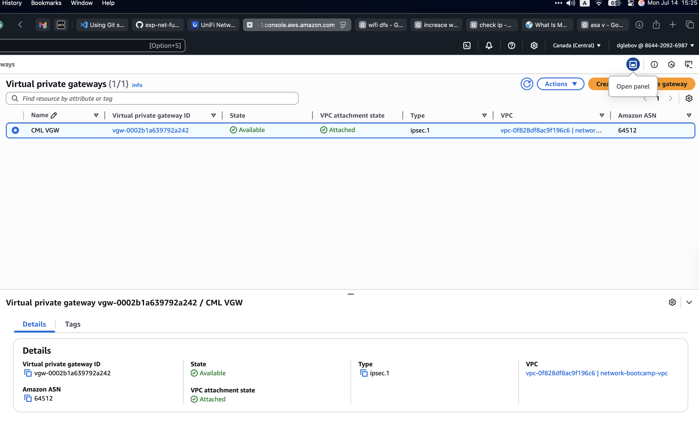
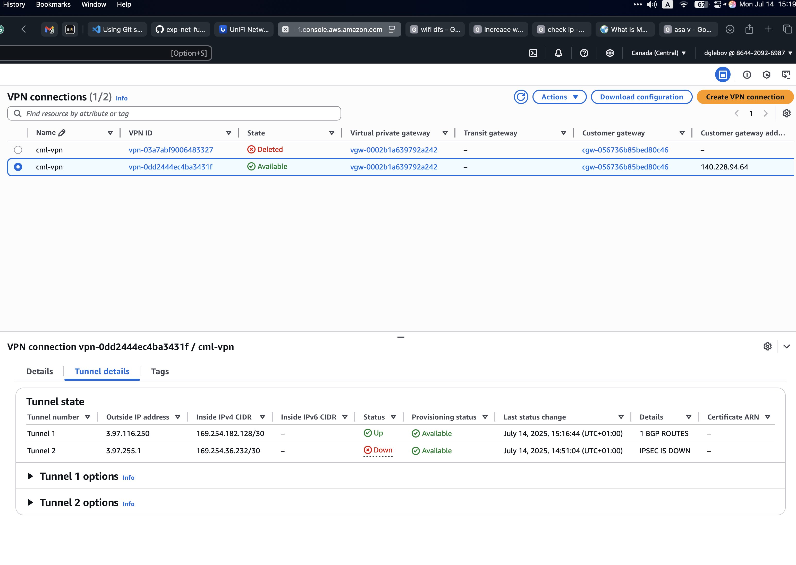
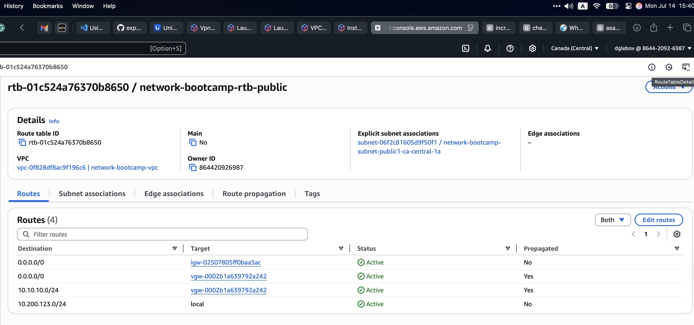
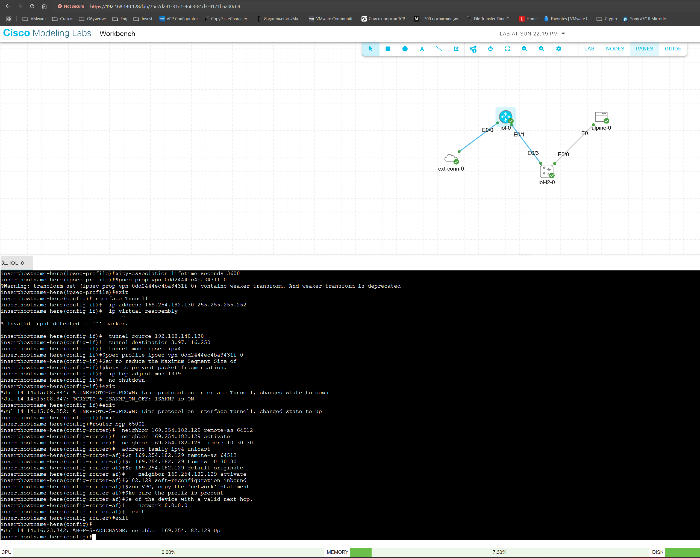
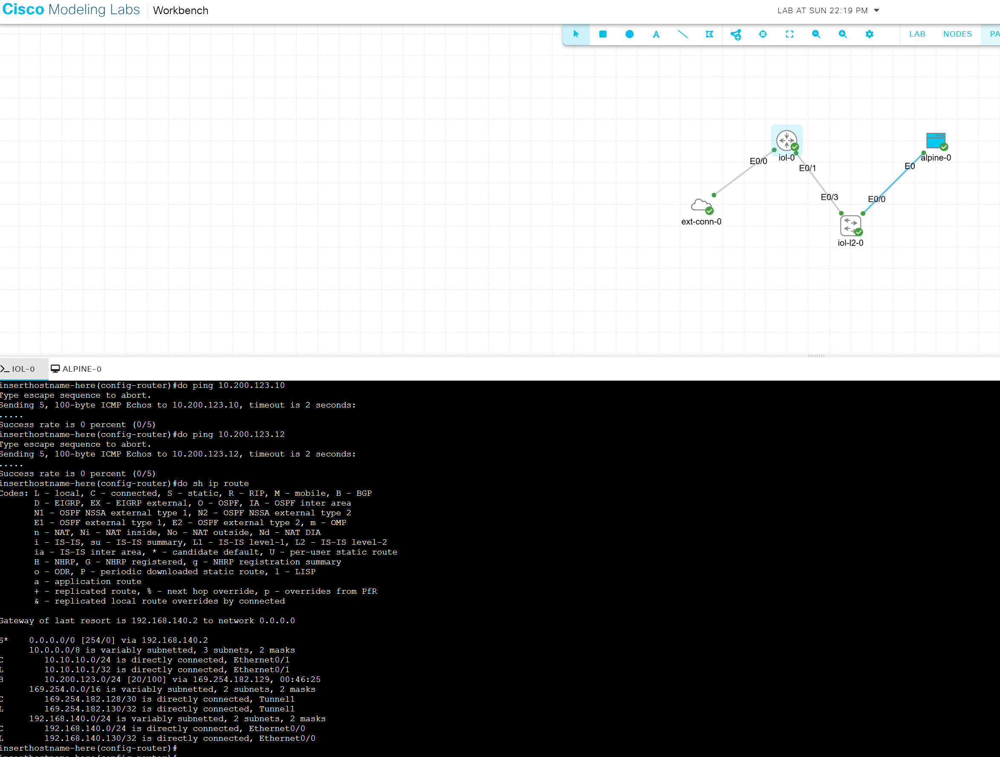
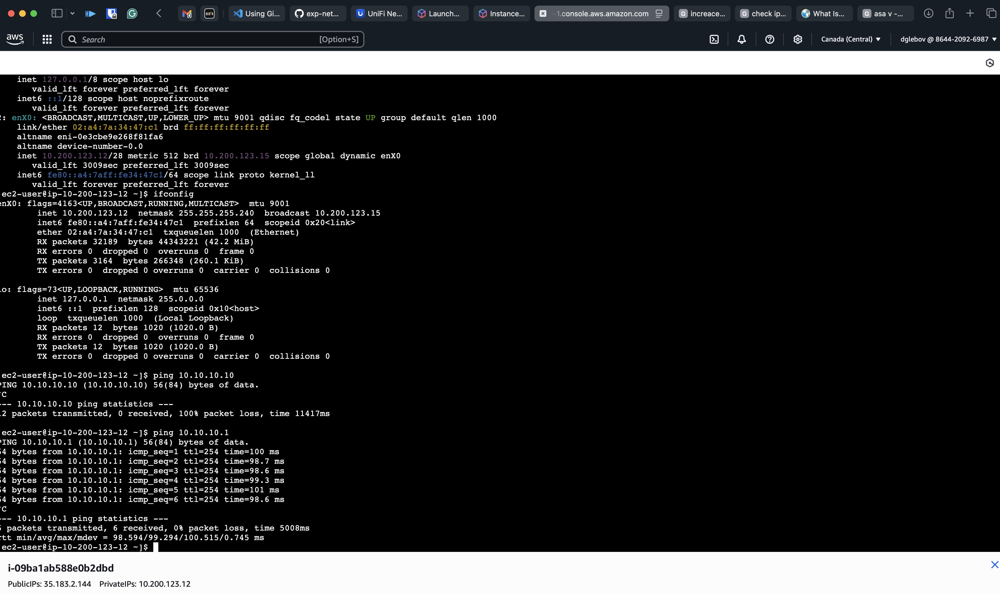

## VPN
The purpose of this lab is to provide general knowledge about VPN. 
For this, we used CML (Cisco Modelling Labs), a tool that can emulate genuine Cisco networking software. 

### CML
I used CML Free, which has sole limitations, and the major one is the limited number of images available. It only includes images for IOLv, IOLvL2, and ASAv. This makes importing the lab from the shared repository impossible due to the lack of a Cisco 8000v image.
That's why I came up with a similar design using available IOLv and IOLvL2 images: 

### AWS Consiguration 
On the AWS we need to acomplish several steps to create VPN: 
* Create Customer Gateway.
An AWS Customer Gateway represents your on-premises network device (like a router or firewall) in a site-to-site VPN setup with AWS. It enables secure communication between your on-premises network and an AWS Virtual Private Cloud (VPC) by connecting to a Virtual Private Gateway or Transit Gateway. 
* Create Virtual Private Gateway and attach it to VPC. An AWS Virtual Private Gateway (VGW) is the AWS-side endpoint of a site-to-site VPN connection that allows secure communication between your Amazon VPC and an external network (such as your on-premises data center). It enables you to connect your VPC to a Customer Gateway via an IPsec VPN tunnel, supporting both static and dynamic (BGP) routing. 
* After that we can create VPN connection and download config for Cisco IOS.
As per below - we used only single tunnel as for lab purposes we don't need redundancy, but still we'd used BGP for dynamic routing. 

* Propogate route for both internal and external route tables. 
To make our services accessible through the VPN tunnel, we need to ensure that the networks advertised via BGP from our side are available and reachable from the AWS VPC. 

### IOS Configuration
For lab purposes, I downloaded the auto-generated VPN configuration from AWS for Cisco IOS. However, the configuration contains a bug where the handshake algorithm always uses "group 2," which is considered insecure.
And then copy the config in to CML console: 

After connection was established we can see routes to our VPC in AWS: 

To test connectivity, I attempted to ping a VM inside the VPC but was unsuccessful. However, I was able to ping the internal interface of IOLv-0 (10.10.10.1), which confirms that the VPN tunnel is working; the issue is likely related to Cisco routing, which I currently lack the expertise to troubleshoot.

