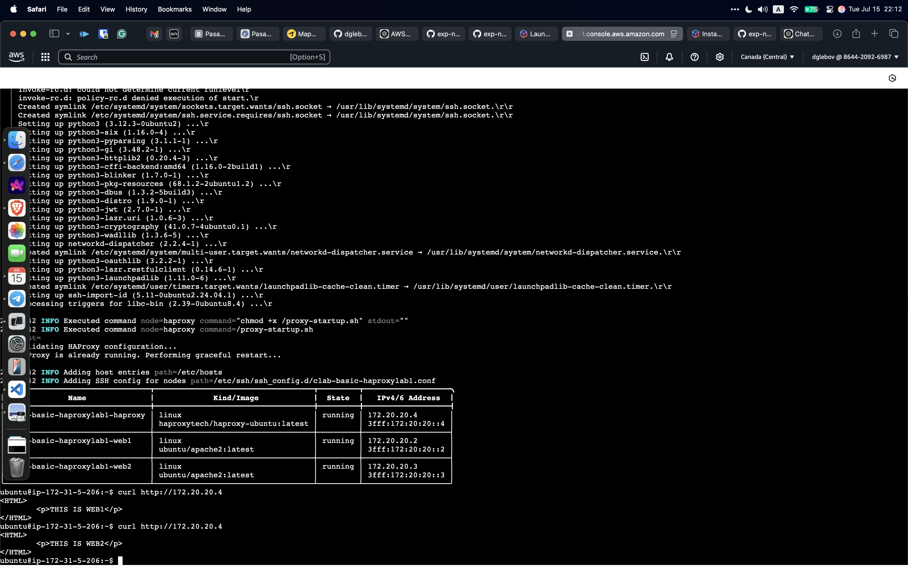

## HA Proxy

HAProxy (High Availability Proxy) is a robust open-source solution widely used as a load balancer and reverse proxy. It directs incoming traffic to multiple backend servers, enhancing application availability, resilience, and performance.

During the lab scenario, I used a previously created Ubuntu host along with the latest version of Containerlab — a free, open-source CLI tool for building, managing, and tearing down virtual networking labs using containers and, optionally, virtual machines.
All the necessary configuration files are available on [GitHub](https://github.com/omenking/exp-net-fundamentals-2025-Q2/tree/main/projects/ha-proxy).

After the deploymen I testded HA Proxy with CURL and it worked:
