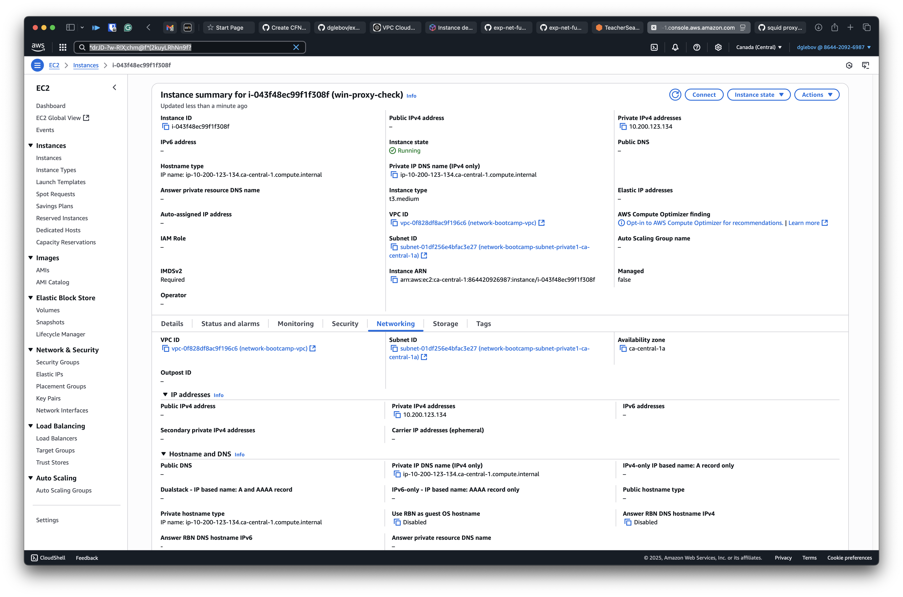

# Proxy

A forward proxy is a network device that sits between internal clients and the Internet. It’s primarily used to enforce security policies—blocking or filtering traffic—and to improve performance by caching outbound requests.

A reverse proxy, on the other hand, fronts one or more internal servers and appears as a single public endpoint. It can handle load balancing, SSL/TLS offloading, and intelligent request routing, while keeping your backend infrastructure hidden from external clients.

## Forward proxy lab 
In our forward‑proxy lab, we use an Ubuntu server running Squid. The configuration is relatively straightforward:



And don't forget to apply windows proxy config:

```text
netsh winhttp set proxy 10.200.123.134:3128
```


### Reverse proxy
For the reverse‑proxy lab, I used the same Ubuntu server and Squid setup—no changes were needed, since the configuration above already includes the reverse‑proxy directives.


As per screenshot we access "proxy-demo" url, which is hosted on the IIS server inside Windows VM from the froward proxy lab, from local safari browser. 