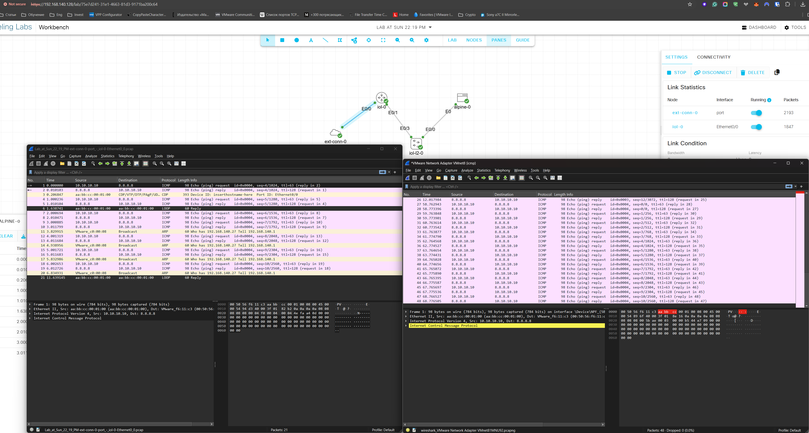

## Wireshark

Wireshark is a free tool that lets you see what’s happening on a computer network — kind of like a microscope for network traffic.

In simple terms:

It captures data (called "packets") that travel over a network.
You can use it to see details of what's being sent and received, like websites visited, devices talking to each other, or problems in the connection.
It’s helpful for troubleshooting, learning about networks, or even detecting suspicious activity.
Imagine you're listening to a conversation between two people — Wireshark lets you "listen" to what computers are saying to each other over the network.

I’ve been using Wireshark for years, so I tested it against a CML lab setup and performed a capture as suggested in the video:

