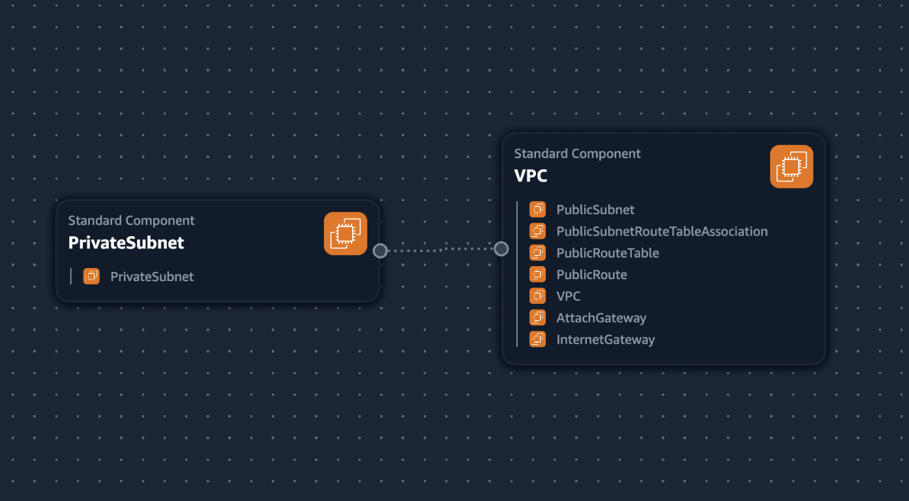
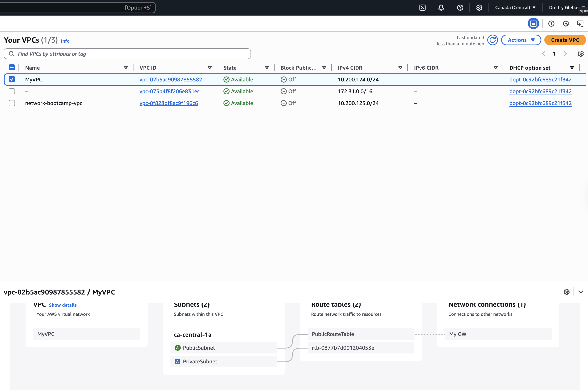

## VCP Settings

These are VPC settings that we'll use in our cloud environment in AWS:
VPC IPv4 CIDR: 10.200.124.0/24 (because we created .123 manually)
IPv6 CIDR Block: No 
Number of AZs: 1 
Number of public subnets: 1 
Number of Private Subnets: 1
NAT GW: none
VPC endpoints: none
DNS: Enable DNS host Names & Enable DNS Resolution 

## Generated and Review CFN Template

I used ChatGPT to generate the template according to the instructor's provided settings

## Generated deploy script

Using the ChatGPT-generated deploy script, I made it platform-agnostic. 

## Visualisation Infrastructure Composer

Generated version is not what was expected: 

## Install AWS CLI

Before running the script, we need to install AWS CLI
Please use AWS instructions: https://docs.aws.amazon.com/cli/latest/userguide/getting-started-install.html

## Actual VPC resoures map 

