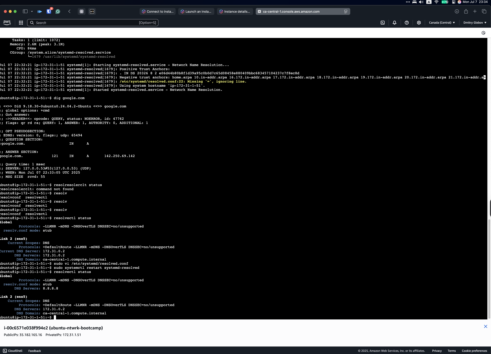

## Resolver



## WGET vs CURL
wget is a tool used to download content — as the name suggests, it stands for "web get."

curl is a tool for working with different protocols like HTTP and HTTPS. It can also be used to interact with APIs, as it supports various methods and headers. Additionally, curl can be used to download files.

In short:
wget is like an axe, while curl is like a Swiss Army knife.


## Curl 
```bash 
ubuntu@ip-172-31-1-51:~$ curl https://google.com
<HTML><HEAD><meta http-equiv="content-type" content="text/html;charset=utf-8">
<TITLE>301 Moved</TITLE></HEAD><BODY>
<H1>301 Moved</H1>
The document has moved
<A HREF="https://www.google.com/">here</A>.
</BODY></HTML>
```

## Wgen
```bash 
ubuntu@ip-172-31-1-51:~$ wget https://google.com
--2025-07-07 22:36:33--  https://google.com/
Resolving google.com (google.com)... 142.250.69.142, 2607:f8b0:4020:801::200e
Connecting to google.com (google.com)|142.250.69.142|:443... connected.
HTTP request sent, awaiting response... 301 Moved Permanently
Location: https://www.google.com/ [following]
--2025-07-07 22:36:33--  https://www.google.com/
Resolving www.google.com (www.google.com)... 142.250.69.132, 2607:f8b0:4020:800::2004
Connecting to www.google.com (www.google.com)|142.250.69.132|:443... connected.
HTTP request sent, awaiting response... 200 OK
Length: unspecified [text/html]
Saving to: ‘index.html’

index.html                                                  [ <=>                                                                                                                          ]  17.38K  --.-KB/s    in 0s      

2025-07-07 22:36:33 (126 MB/s) - ‘index.html’ saved [17801]
```

## Linux Firewall Option

We also explore a couple of Linux FW options. Those options depend on what you need: 
Simple - ufw(Debian-based distros), firewalld (RedHat-based distros) or Iptables. 	


MAN is a valuable tool for exploring different options. 
Some of FW are installed by default, such as iptables; others require installation or enabling. 

Generally speaking, LLMs are your friend when you work with Linux FW. 