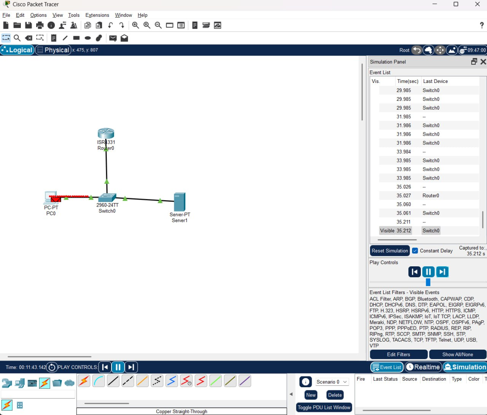

# State of the Network

While exploring Packet Tracer, I simulated a typical home networking environment using a router, switch, and DHCP server. Although in a real home setup these functions are usually combined into a single device, in our simulation we used three separate devices to better understand how packet flow works.

This setup allowed us to observe PDUs (Protocol Data Units) at each stage and notice how different devices handle different layers of data. For example, a switch only forwards Layer 2 (L2) data.

Overall, this was a useful example and exercise for building a basic understanding of networking.

