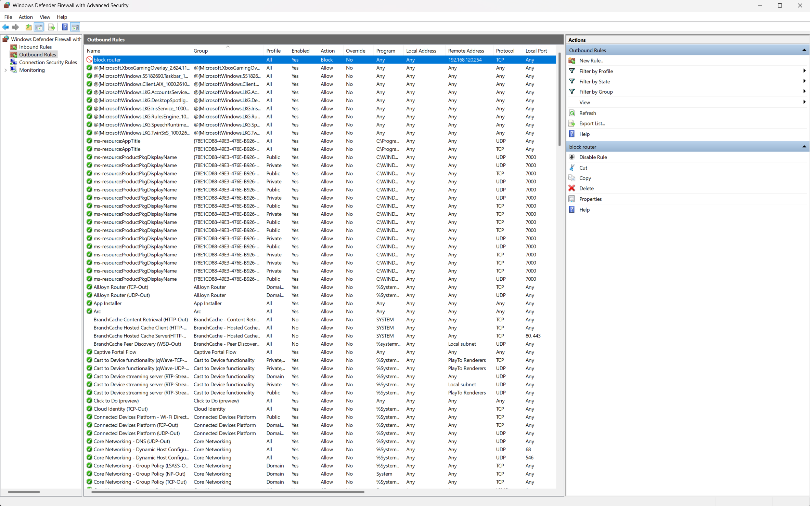

## Windows firewall practice 
For Windows FW practice task I've used my own PC. 
I setup a rule that will block connection to HPPT port of my homerouter. 
I create a rule that will block port 80 on spetifict IP address 

```powershell
PS C:\Users\Demon> curl http://192.168.120.254
<html>
<head><title>301 Moved Permanently</title></head>
<body>
<center><h1>301 Moved Permanently</h1></center>
<hr><center>nginx</center>
</body>
</html>
PS C:\Users\Demon> curl http://192.168.120.254
curl: (7) Failed to connect to 192.168.120.254 port 80 after 0 ms: Could not connect to server
PS C:\Users\Demon>
```

