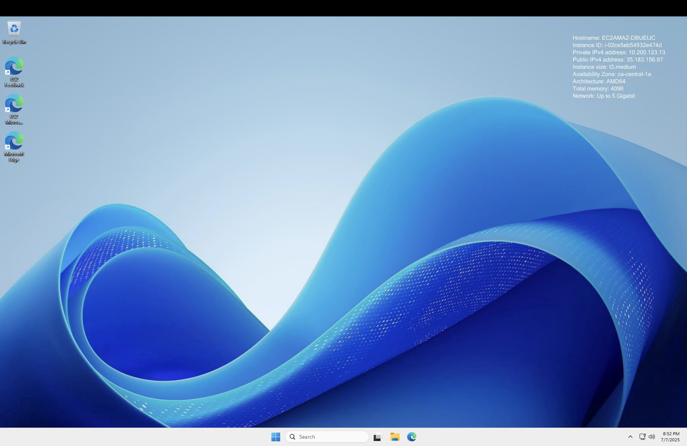

## Developer Enviroment

I'm using EC2 instance, that was deployed during previous lessons: 




## IP Consig

```text
C:\Users\Administrator>ipconfig /all

Windows IP Configuration

   Host Name . . . . . . . . . . . . : EC2AMAZ-DBUEIJC
   Primary Dns Suffix  . . . . . . . :
   Node Type . . . . . . . . . . . . : Hybrid
   IP Routing Enabled. . . . . . . . : No
   WINS Proxy Enabled. . . . . . . . : No
   DNS Suffix Search List. . . . . . : ec2.internal
                                       us-east-1.ec2-utilities.amazonaws.com
                                       ca-central-1.compute.internal
                                       ca-central-1.ec2-utilities.amazonaws.com

Ethernet adapter Ethernet:

   Connection-specific DNS Suffix  . : ca-central-1.compute.internal
   Description . . . . . . . . . . . : Amazon Elastic Network Adapter
   Physical Address. . . . . . . . . : 02-2F-A3-3A-ED-65
   DHCP Enabled. . . . . . . . . . . : Yes
   Autoconfiguration Enabled . . . . : Yes
   Link-local IPv6 Address . . . . . : fe80::403:fd69:2333:cc49%3(Preferred)
   IPv4 Address. . . . . . . . . . . : 10.200.123.13(Preferred)
   Subnet Mask . . . . . . . . . . . : 255.255.255.240
   Lease Obtained. . . . . . . . . . : Monday, July 7, 2025 8:50:37 PM
   Lease Expires . . . . . . . . . . : Monday, July 7, 2025 9:50:37 PM
   Default Gateway . . . . . . . . . : 10.200.123.1
   DHCP Server . . . . . . . . . . . : 10.200.123.1
   DHCPv6 IAID . . . . . . . . . . . : 84821943
   DHCPv6 Client DUID. . . . . . . . : 00-01-00-01-2F-D2-52-67-02-2F-A3-3A-ED-65
   DNS Servers . . . . . . . . . . . : 10.200.123.2
   NetBIOS over Tcpip. . . . . . . . : Enabled

Ethernet adapter Ethernet 2:

   Connection-specific DNS Suffix  . : ca-central-1.compute.internal
   Description . . . . . . . . . . . : Amazon Elastic Network Adapter #2
   Physical Address. . . . . . . . . : 02-13-79-3B-C5-CB
   DHCP Enabled. . . . . . . . . . . : Yes
   Autoconfiguration Enabled . . . . : Yes
   Link-local IPv6 Address . . . . . : fe80::1e2d:e70a:ee6c:5c01%5(Preferred)
   IPv4 Address. . . . . . . . . . . : 10.200.123.139(Preferred)
   Subnet Mask . . . . . . . . . . . : 255.255.255.240
   Lease Obtained. . . . . . . . . . : Monday, July 7, 2025 8:50:37 PM
   Lease Expires . . . . . . . . . . : Monday, July 7, 2025 9:50:37 PM
   Default Gateway . . . . . . . . . : 10.200.123.129
   DHCP Server . . . . . . . . . . . : 10.200.123.129
   DHCPv6 IAID . . . . . . . . . . . : 167908217
   DHCPv6 Client DUID. . . . . . . . : 00-01-00-01-2F-D2-52-67-02-2F-A3-3A-ED-65
   DNS Servers . . . . . . . . . . . : 10.200.123.2
   NetBIOS over Tcpip. . . . . . . . : Enabled
```
## Ping 

```text
C:\Users\Administrator>ping 8.8.8.8

Pinging 8.8.8.8 with 32 bytes of data:
Reply from 8.8.8.8: bytes=32 time=1ms TTL=112
Reply from 8.8.8.8: bytes=32 time=1ms TTL=112
Reply from 8.8.8.8: bytes=32 time=1ms TTL=112
Reply from 8.8.8.8: bytes=32 time=1ms TTL=112

Ping statistics for 8.8.8.8:
    Packets: Sent = 4, Received = 4, Lost = 0 (0% loss),
Approximate round trip times in milli-seconds:
    Minimum = 1ms, Maximum = 1ms, Average = 1ms
```

## Trace Route 

```text
C:\Users\Administrator>tracert google.com

Tracing route to google.com [142.250.69.46]
over a maximum of 30 hops:

  1     *        *        *     Request timed out.
  2     *        *        *     Request timed out.
  3     1 ms     1 ms     1 ms  99.83.65.228
  4     1 ms     1 ms     1 ms  99.83.65.229
  5     1 ms     1 ms     1 ms  142.251.51.179
  6     2 ms     2 ms     2 ms  142.250.238.147
  7     1 ms     1 ms     1 ms  qro02s19-in-f14.1e100.net [142.250.69.46]
```


## Netstat 

```text
C:\Users\Administrator>netstat

Active Connections

  Proto  Local Address          Foreign Address        State
  TCP    10.200.123.13:3389     94:13123               ESTABLISHED


C:\Users\Administrator>netstat -a

Active Connections

  Proto  Local Address          Foreign Address        State
  TCP    0.0.0.0:135            EC2AMAZ-DBUEIJC:0      LISTENING
  TCP    0.0.0.0:445            EC2AMAZ-DBUEIJC:0      LISTENING
  TCP    0.0.0.0:3389           EC2AMAZ-DBUEIJC:0      LISTENING
  TCP    0.0.0.0:5985           EC2AMAZ-DBUEIJC:0      LISTENING
  TCP    0.0.0.0:47001          EC2AMAZ-DBUEIJC:0      LISTENING
  TCP    0.0.0.0:49664          EC2AMAZ-DBUEIJC:0      LISTENING
  TCP    0.0.0.0:49665          EC2AMAZ-DBUEIJC:0      LISTENING
  TCP    0.0.0.0:49666          EC2AMAZ-DBUEIJC:0      LISTENING
  TCP    0.0.0.0:49667          EC2AMAZ-DBUEIJC:0      LISTENING
  TCP    0.0.0.0:49668          EC2AMAZ-DBUEIJC:0      LISTENING
  TCP    0.0.0.0:49669          EC2AMAZ-DBUEIJC:0      LISTENING
  TCP    0.0.0.0:49672          EC2AMAZ-DBUEIJC:0      LISTENING
  TCP    10.200.123.13:139      EC2AMAZ-DBUEIJC:0      LISTENING
  TCP    10.200.123.13:3389     94:13123               ESTABLISHED
  TCP    10.200.123.139:139     EC2AMAZ-DBUEIJC:0      LISTENING
  TCP    [::]:135               EC2AMAZ-DBUEIJC:0      LISTENING
  TCP    [::]:445               EC2AMAZ-DBUEIJC:0      LISTENING
  TCP    [::]:3389              EC2AMAZ-DBUEIJC:0      LISTENING
  TCP    [::]:5985              EC2AMAZ-DBUEIJC:0      LISTENING
  TCP    [::]:47001             EC2AMAZ-DBUEIJC:0      LISTENING
  TCP    [::]:49664             EC2AMAZ-DBUEIJC:0      LISTENING
  TCP    [::]:49665             EC2AMAZ-DBUEIJC:0      LISTENING
  TCP    [::]:49666             EC2AMAZ-DBUEIJC:0      LISTENING
  TCP    [::]:49667             EC2AMAZ-DBUEIJC:0      LISTENING
  TCP    [::]:49668             EC2AMAZ-DBUEIJC:0      LISTENING
  TCP    [::]:49669             EC2AMAZ-DBUEIJC:0      LISTENING
  TCP    [::]:49672             EC2AMAZ-DBUEIJC:0      LISTENING
  UDP    0.0.0.0:123            *:*
  UDP    0.0.0.0:3389           *:*
  UDP    0.0.0.0:5353           *:*
  UDP    0.0.0.0:5355           *:*
  UDP    0.0.0.0:56304          *:*
  UDP    0.0.0.0:59598          *:*
  UDP    10.200.123.13:137      *:*
  UDP    10.200.123.13:138      *:*
  UDP    10.200.123.139:137     *:*
  UDP    10.200.123.139:138     *:*
  UDP    127.0.0.1:54691        127.0.0.1:54691
  UDP    [::]:123               *:*
  UDP    [::]:3389              *:*
  UDP    [::]:5353              *:*
  UDP    [::]:5355              *:*
  UDP    [::]:56304             *:*
  UDP    [::]:59598             *:*

```


## Route 

```text
C:\Users\Administrator>route print
===========================================================================
Interface List
  3...02 2f a3 3a ed 65 ......Amazon Elastic Network Adapter
  5...02 13 79 3b c5 cb ......Amazon Elastic Network Adapter #2
  1...........................Software Loopback Interface 1
===========================================================================

IPv4 Route Table
===========================================================================
Active Routes:
Network Destination        Netmask          Gateway       Interface  Metric
          0.0.0.0          0.0.0.0     10.200.123.1    10.200.123.13     20
          0.0.0.0          0.0.0.0   10.200.123.129   10.200.123.139     20
     10.200.123.0  255.255.255.240         On-link     10.200.123.13    276
    10.200.123.13  255.255.255.255         On-link     10.200.123.13    276
    10.200.123.15  255.255.255.255         On-link     10.200.123.13    276
   10.200.123.128  255.255.255.240         On-link    10.200.123.139    276
   10.200.123.139  255.255.255.255         On-link    10.200.123.139    276
   10.200.123.143  255.255.255.255         On-link    10.200.123.139    276
        127.0.0.0        255.0.0.0         On-link         127.0.0.1    331
        127.0.0.1  255.255.255.255         On-link         127.0.0.1    331
  127.255.255.255  255.255.255.255         On-link         127.0.0.1    331
  169.254.169.123  255.255.255.255         On-link     10.200.123.13     40
  169.254.169.249  255.255.255.255         On-link     10.200.123.13     40
  169.254.169.250  255.255.255.255         On-link     10.200.123.13     40
  169.254.169.251  255.255.255.255         On-link     10.200.123.13     40
  169.254.169.253  255.255.255.255         On-link     10.200.123.13     40
  169.254.169.254  255.255.255.255         On-link     10.200.123.13     40
        224.0.0.0        240.0.0.0         On-link         127.0.0.1    331
        224.0.0.0        240.0.0.0         On-link    10.200.123.139    276
        224.0.0.0        240.0.0.0         On-link     10.200.123.13    276
  255.255.255.255  255.255.255.255         On-link         127.0.0.1    331
  255.255.255.255  255.255.255.255         On-link    10.200.123.139    276
  255.255.255.255  255.255.255.255         On-link     10.200.123.13    276
===========================================================================
Persistent Routes:
  None

IPv6 Route Table
===========================================================================
Active Routes:
 If Metric Network Destination      Gateway
  1    331 ::1/128                  On-link
  3     40 fd00:ec2::123/128        On-link
  3     40 fd00:ec2::250/128        On-link
  3     40 fd00:ec2::253/128        On-link
  3     40 fd00:ec2::254/128        On-link
  5    276 fe80::/64                On-link
  3    276 fe80::/64                On-link
  3    276 fe80::403:fd69:2333:cc49/128
                                    On-link
  5    276 fe80::1e2d:e70a:ee6c:5c01/128
                                    On-link
  1    331 ff00::/8                 On-link
  5    276 ff00::/8                 On-link
  3    276 ff00::/8                 On-link
===========================================================================
Persistent Routes:
  None
```
